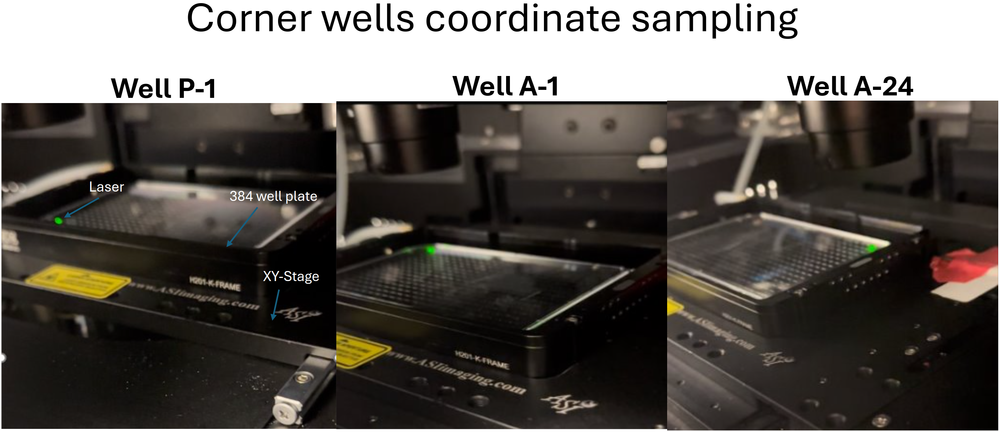
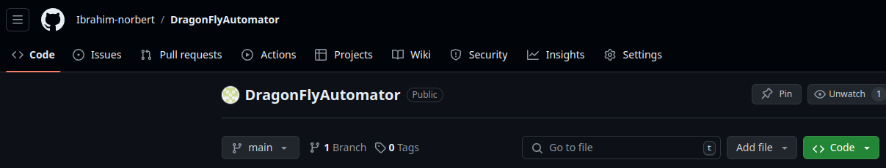

# DragonFlyAutomator

## Description
DragonFlyAutomator is a software that automates the process of image acquisition of a multiwell plate for the Dragonfly Andor 505 microscope.
Single channel image acquisition is performed using Protocol 59, so please ensure this protocol is present in the Fusion software.
Protocol 59 must have the following settings: Dapi channel and single burst mode. The protocol is required for autofocusing and executed 
at each z-plane position. Well positioning is performed either by linear spacing or homography transformation.
Both methods require sampling of well corners as illustrated in the following images:

## Installation
### Windows
1. Create a python virtual environment by adding: python -m venv DragonFlyAutomator
2. Step into the new folder: cd DragonFlyAutomator
3. Activate the python environment: Scripts\Activate.ps1 
     1. (Ignore this info) Afterwards sys.prefix and sys.exec_prefix point to this 
4. Install the software with: pip install https://github.com/Ibrahim-norbert/DragonFlyAutomator/raw/main/dist/DragonFlyAutomator-0.0.1-py3-none-any.whl
5. Then start the application by adding: DragonFlyAutomator --test false

### Mac OS
1. Confirm if python is installed by adding: python3 --version
2. If not installed, please follow the instructions given in the terminal. Otherwise, continue with the next steps.
3. Create an environment by adding: python -m venv DragonFlyAutomator
4. Step into the new folder: cd DragonFlyAutomator
5. Activate the environment by adding: bash bin/activate
6. Install the software with: pip install https://github.com/Ibrahim-norbert/DragonFlyAutomator/raw/main/dist/DragonFlyAutomator-0.0.1-py3-none-any.whl

## Submitting an issue
If you encounter any issues, please submit them to the issue tab provided in the repositiory.
It can be found here 
